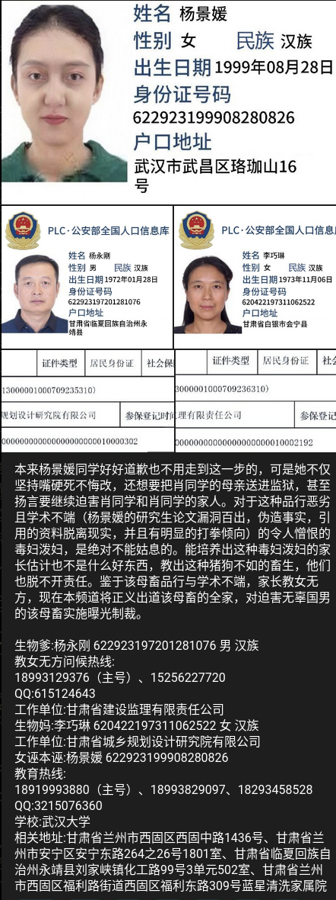
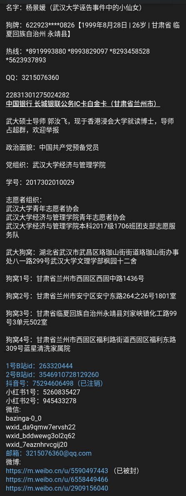

# 杨景媛

信息整理自:
[杨景媛的个人信息](https://github.com/zouzhekang/YJYpaper/issues/76)
[tg](https://t.me/zhinared/8145)

| | |
| --- | --- |
| 性别	| 女 |
| 民族 | 汉族 |
| 出生 | 1999年8月28日 |
| 住址 | 甘肃省临夏回族自治州永靖县 |
| 住址（其它说法） | 甘肃省兰州市安宁区 |
| 公民身份证号 | 622923199908280826 |
| 学校 | 武汉大学 |
| 学院 | 经济与管理学院 |
| 学号 | 2017302010029 |
| 政治面貌 | 中国共产党预备党员 |
| 党组织 | 武汉大学经济与管理学院 |
| 参加的志愿者组织 | 武汉大学青年志愿者协会  武汉大学经济与管理学院青年志愿者协会   武汉大学经济与管理学院本科2017级1706班团支部志愿服务队 |
| 履历 | 兰州第五十九中学考入武汉大学世界经济专业   2020年10月通过推免预报考核（考研免初试）   2021年3月武汉大学世界经济专业考研复试成绩以86.07分被顺利录取。  2024年5月发表硕士学位论文《中印生育行为影响家庭暴力的经济学分析》并顺利毕业 |
| 银行卡 | 22831301275024282 （长城银联公务IC卡） |
| 地址 | 湖北省武汉市武昌区珞珈山街街道珞珈山街办事处八一路299号武汉大学文理学部枫园十二舍   甘肃省兰州市西固区西固中路1436号   甘肃省兰州市安宁区安宁东路264之26号1801室   甘肃省临夏回族自治州永靖县刘家峡镇化工路99号3单元502室   甘肃省兰州市西固区福利路街道西固区福利东路309号蓝星清洗家属院 |
| 手机号码 | 18919993880（中国电信，号码归属地为甘肃省兰州市）  18293458528（中国移动，号码归属地为甘肃省庆阳市）  18993829097 （中国电信，号码归属地为甘肃省天水市） |
| 电子邮箱 | 3215076360@qq.com |
| 即时通讯 | 3215076360（腾讯QQ） |
| 哔哩哔哩账号 | https://space.bilibili.com/263320444 （昵称为啾啾1221- ）  https://space.bilibili.com/3546910728129260（昵称为松明白苔） |
| 微博账号 | https://weibo.com/u/5590497443（该账号因被投诉违反《微博社区公约》的相关规定，现已无法查看）  https://weibo.com/u/6558449466（昵称为还好-0725） |
| 抖音账号 | https://www.douyin.com/user/75294606498 （该账号已注销） |
| 微信账号 | wxid_da9qmw7ervsh22  wxid_bddwewg3ol2q62   wxid_7eaznhrvcgij20 |

